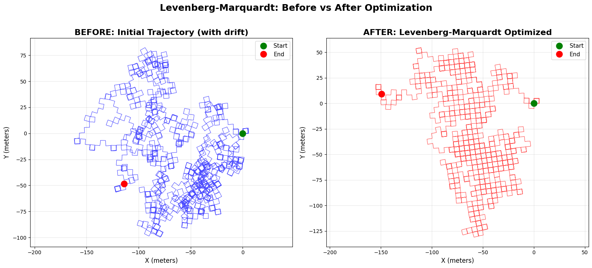
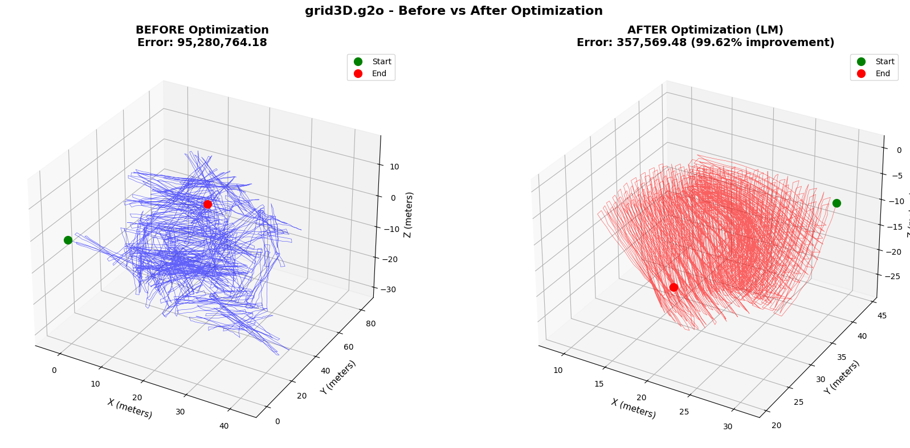
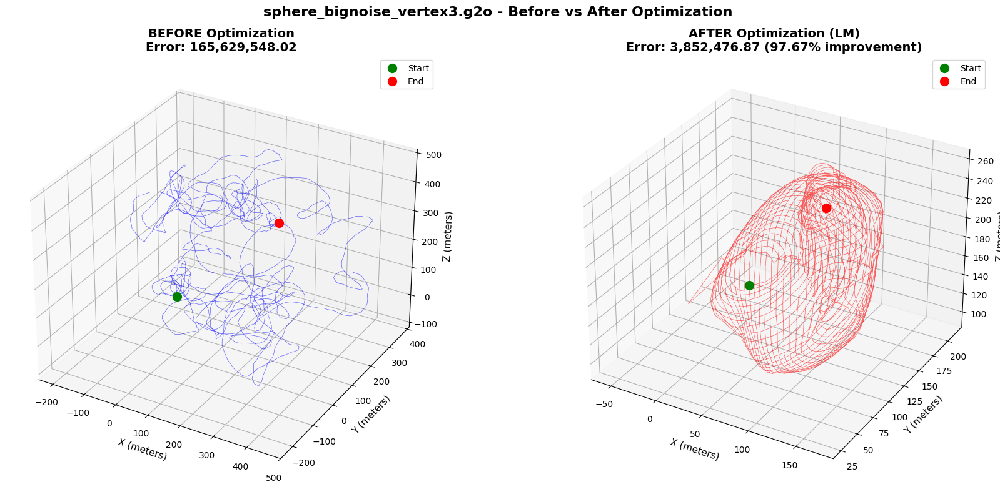
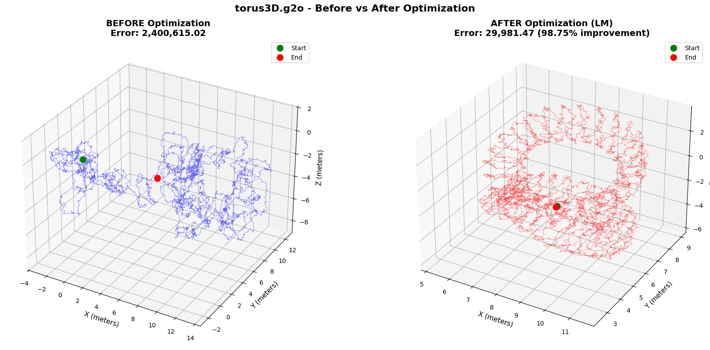

# Pose-Graph SLAM with Levenberg–Marquardt (GTSAM)

This project implements **2D pose-graph SLAM** using the **Georgia Tech Smoothing and Mapping (GTSAM)** library. The pipeline loads a pose graph from file, applies structural and noise-model adjustments, and optimizes the trajectory with the **Levenberg–Marquardt** algorithm to correct odometry drift using loop-closure constraints.

---

## Results: Before vs After Optimization

Running the notebooks (or `OptimizerScript.py`) produces side-by-side comparisons: the left panel shows the initial trajectory (with drift), and the right panel shows the trajectory after Levenberg–Marquardt optimization.

### 2D pose-graph (loop closure)

*From `GTSAM_LM_LoopClosure.ipynb` or `OptimizerScript.py` — written to `GTSAM_LM_OptimizedTrajectory.png`.*

### 3D datasets (GTSAM_LM.ipynb)

**grid3D.g2o**

**sphere_bignoise_vertex3.g2o**

**torus3D.g2o**

*The three figures above are written to `GTSAM_LM_grid3D.png`, `GTSAM_LM_Sphere.png`, and `GTSAM_LM_Torus.png` when `GTSAM_LM.ipynb` is run.*

**Target shapes (ideal, error-free).** In the absence of any error, the trajectories would match clean geometric shapes: the **grid3D** dataset would form a regular 3D grid; the **sphere** dataset would lie on a perfect sphere; the **torus** would form a perfect torus; and the **2D M10000** trajectory would form a consistent Manhattan-world loop that closes exactly (start and end coincide). Those are the “ground truth” shapes the robot would have traversed if odometry and loop-closure measurements were noiseless and perfectly consistent.

**Why the results are not exactly ideal.** The optimized trajectories are not error-free or perfectly aligned to those shapes for several reasons. (1) **Measurement noise:** the datasets are generated with simulated (or real) noise on odometry and loop-closure measurements, so the constraints are mutually inconsistent. (2) **Weighted least-squares compromise:** the optimizer minimizes a weighted sum of squared errors; it finds the best compromise among conflicting constraints rather than satisfying all of them exactly. (3) **Loop-closure conflicts:** especially in 2D, wrong or noisy loop closures can pull the solution away from the true loop. (4) **Convergence:** Levenberg–Marquardt converges to a local minimum, which may not be the global minimum if the problem is non-convex. So the plots show a *corrected* trajectory that is much closer to the ideal shape than the initial drift, but residual error and slight shape distortion are expected.

---

## The two notebooks

This repo contains two Jupyter notebooks that demonstrate Levenberg–Marquardt optimization on different pose-graph SLAM problems.

### `GTSAM_LM_LoopClosure.ipynb`

- **Purpose:** 2D pose-graph SLAM with **loop closure** on a large trajectory.
- **Input:** `M10000_P_toro.graph` (2D pose graph in TORO format, 10,000 poses).
- **What it does:** Loads the graph, adds a prior on the first pose, runs Levenberg–Marquardt optimization, and compares the initial (drifting) trajectory with the optimized one. It also reports loop-closure error, large jumps, and trajectory statistics.
- **Output:** Console diagnostics and `GTSAM_LM_OptimizedTrajectory.png` (before/after 2D plot).

### `GTSAM_LM.ipynb`

- **Purpose:** **3D** pose-graph SLAM on three standard benchmark datasets (grid, sphere with noise, torus).
- **Input:** `grid3D.g2o`, `sphere_bignoise_vertex3.g2o`, and `torus3D.g2o` (downloaded in the notebook via `wget`).
- **What it does:** Loads each .g2o file, runs Levenberg–Marquardt on each graph, and visualizes the 3D trajectory before and after optimization for all three datasets. Reports error reduction and trajectory statistics per dataset.
- **Output:** Console diagnostics and three figures: `GTSAM_LM_grid3D.png`, `GTSAM_LM_Sphere.png`, `GTSAM_LM_Torus.png`.

Together, the two notebooks cover **2D loop-closure SLAM** (Loop Closure) and **3D multi-dataset SLAM** (GTSAM_LM).

---

## Datasets

The pose-graph datasets used in this project (2D TORO/M10000 and 3D g2o: grid, sphere, torus) are from **[Luca Carlone’s datasets page](https://lucacarlone.mit.edu/datasets/)** at MIT. Please refer to that site for descriptions, citations, and download links. When using these datasets, cite the papers indicated there (e.g. for 3D: Carlone et al., ICRA 2015; for 2D: Carlone & Censi, IEEE T-RO 2014; Carlone et al., IJRR 2014).

---

## What `OptimizerScript.py` does (optional)

If you use the standalone script instead of the loop-closure notebook:

1. **Load** a 2D pose graph from `M10000_P_toro.graph` (TORO noise format).
2. **Stabilize** the graph by adding a prior on the first pose and rebuilding the graph with tuned noise models (strong odometry, weaker loop closures).
3. **Optimize** the graph using GTSAM’s Levenberg–Marquardt optimizer.
4. **Report** diagnostics (factor counts, pose movements, error reduction, timing).
5. **Visualize** the initial and optimized trajectories and save the figure.

---

## How It Works

### 1. Pose-graph SLAM and factor graphs

The state consists of **poses** \(x_0, x_1, \ldots, x_{N-1}\), each a 2D pose \((x, y, \theta)\). The objective is to find the set of poses that best satisfy:
The state consists of **poses** $x_0, x_1, \ldots, x_{N-1}$, each a 2D pose $(x, y, \theta)$. The objective is to find the set of poses that best satisfy:

- **Odometry constraints** between consecutive poses (e.g. from wheel encoders or dead reckoning).
- **Loop-closure constraints** between non-consecutive poses (e.g. from place recognition or scan matching).
- A **prior** on at least one pose (e.g. the first pose at the origin) so the solution is uniquely defined.

This is modeled as a **factor graph**: nodes represent poses (variables) and edges represent constraints (factors). The estimator minimizes a sum of squared weighted errors:

\[
\mathbf{x}^* = \arg\min_{\mathbf{x}} \sum_k \big\| h_k(\mathbf{x}) - z_k \big\|_{\Sigma_k}^2
\]

- \(\mathbf{x}\) = vector of all poses  
- \(z_k\) = measurement (e.g. relative pose between two nodes)  
- \(h_k(\mathbf{x})\) = prediction from current poses  
- \(\|\cdot\|_{\Sigma_k}\) = Mahalanobis norm with covariance \(\Sigma_k\)

GTSAM represents this as a `NonlinearFactorGraph` and solves it with nonlinear least-squares (here, Levenberg–Marquardt).

### 2. Factor types used in the script

| Factor | Role | Noise (in script) |
|--------|------|-------------------|
| **PriorFactorPose2** | Pins pose 0 at \((0,0,0)\) | \(\sigma_{x,y,\theta} = 0.01\) |
| **BetweenFactorPose2** (consecutive) | Odometry between \(i\) and \(i+1\) | \(\sigma_{x,y} = 0.1,\;\sigma_\theta = 0.05\) |
| **BetweenFactorPose2** (non-consecutive) | Loop closure | \(\sigma_{x,y} = 5.0,\;\sigma_\theta = 0.5\) (weaker) |

Weakening loop-closure noise reduces the influence of erroneous loop closures and prevents the graph from converging to poor local minima.

### 3. Levenberg–Marquardt (LM)

The Levenberg–Marquardt method interpolates between **Gauss–Newton** (efficient near the solution) and **gradient descent** (robust when far from it). At each iteration it solves

\[
(\mathbf{H} + \lambda \mathbf{I})\,\Delta\mathbf{x} = -\mathbf{g}
\]

where \(\mathbf{H}\) is the Hessian approximation, \(\mathbf{g}\) is the gradient, and \(\lambda\) is updated each iteration (increased if the step increases the cost, decreased if it reduces it). The script uses `lambdaInitial=1`, `lambdaUpperBound=1e9`, and `lambdaFactor=10`.

### 4. Pipeline (step-by-step)

1. **Load**  
   `gtsam.load2D(..., noiseFormat=NoiseFormatTORO)` → `graph` + `initial` values.

2. **Anchor**  
   Add `PriorFactorPose2(0, Pose2(0,0,0), prior_noise)` so the graph has a fixed reference.

3. **Rebuild graph with custom noise**  
   Iterate over all factors; retain priors and strong odometry, and assign weaker noise to loop closures (distinguished by \(\Delta\text{key} = 1\) for odometry vs \(\Delta\text{key} > 1\) for loop closures).

4. **Optimize**  
   `LevenbergMarquardtOptimizer(graph, initial, params).optimize()` → `result_lm`.

5. **Diagnostics**  
   Compare `graph.error(initial)` vs `graph.error(result_lm)`, report pose movements and factor counts.

6. **Visualization**  
   Extract \((x,y)\) from `initial` and `result_lm`, plot side-by-side. The notebooks save four result images (see **Results** above).

### 5. Input and output

- **Input:** Pose-graph files (e.g. `M10000_P_toro.graph` for 2D, or `grid3D.g2o`, `sphere_bignoise_vertex3.g2o`, `torus3D.g2o` for 3D).  
- **Output:**  
  - Optimized `Values` (pose estimates),  
  - Console diagnostics (errors, iterations, runtime),  
  - **Four result images:** `GTSAM_LM_OptimizedTrajectory.png`, `GTSAM_LM_grid3D.png`, `GTSAM_LM_Sphere.png`, `GTSAM_LM_Torus.png`.

---

## Dependencies

- **Python 3** with **NumPy** and **Matplotlib**
- **GTSAM** (Python bindings): [https://gtsam.org](https://gtsam.org)

---

## How to run

- **2D pose-graph (loop closure):** Place `M10000_P_toro.graph` in this directory and run `GTSAM_LM_LoopClosure.ipynb` (or `python OptimizerScript.py` if you use the script). This produces `GTSAM_LM_OptimizedTrajectory.png`.
- **3D datasets:** Run `GTSAM_LM.ipynb` to optimize grid3D, sphere, and torus datasets. It saves `GTSAM_LM_grid3D.png`, `GTSAM_LM_Sphere.png`, and `GTSAM_LM_Torus.png`.

The notebooks (and script) print optimization and diagnostic output to the console and save the before/after figures shown in **Results** above.

